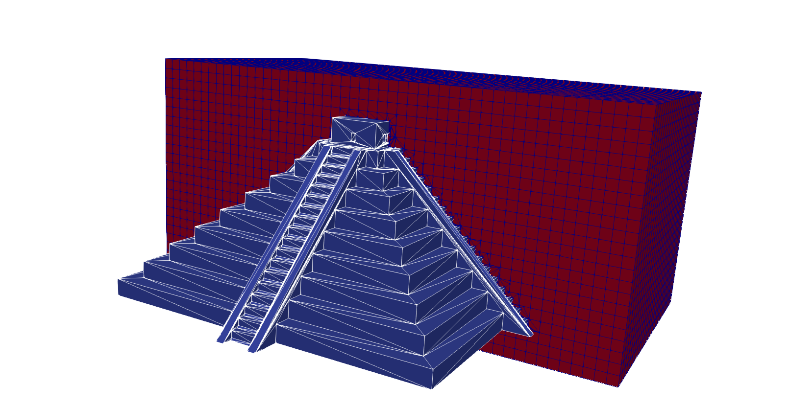
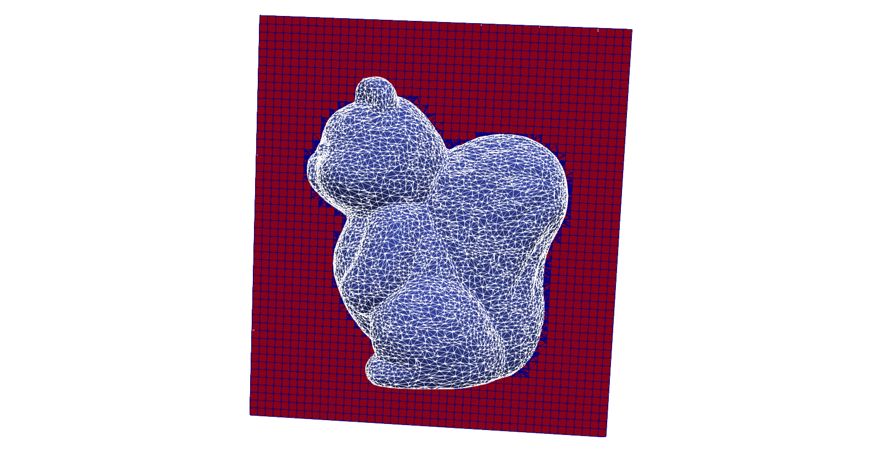
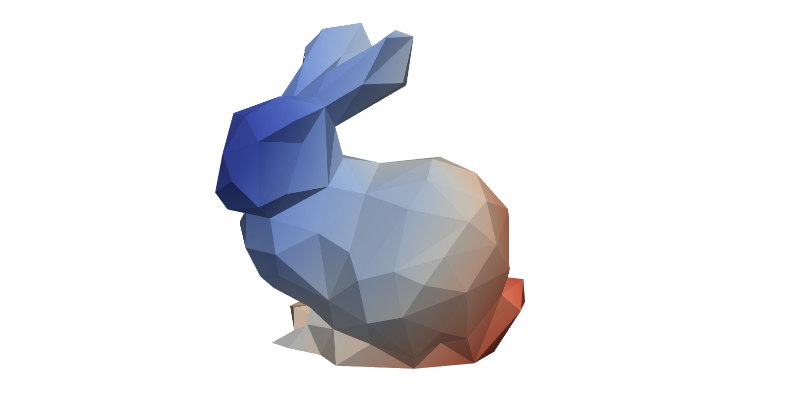

# STLCutters

STL to cell-wise triangulation to solve FE problems in [Gridap.jl](https://github.com/gridap/Gridap.jl) through [GridapEmbedded.jl](https://github.com/gridap/GridapEmbedded.jl)

[](https://zenodo.org/badge/latestdoi/402797993)
[](https://github.com/gridap/STLCutters.jl/actions?query=workflow%3ACI)
[](https://codecov.io/gh/gridap/STLCutters.jl)


## Installation

```julia
# Type ] to enter package mode
pkg> add STLCutters
```

## Examples

### Sub-triangulation examples

Use a test geometry, e.g., 47076.stl (Chichen Itza)
```julia
julia> include("examples/SubTriangulation.jl")
julia> filename = "test/data/47076.stl"
julia> SubTriangulation.main(filename,n=50,output="example1")
```


Download a geometry directly from [Thingi10k](https://ten-thousand-models.appspot.com/), e.g, [37384](https://ten-thousand-models.appspot.com/detail.html?file_id=37384)
```julia
julia> include("examples/SubTriangulation.jl")
julia> filename = SubTriangulation.download(37384)
julia> SubTriangulation.main(filename,n=50,output="example2")
```


### Poisson examples

Solve a Poisson equation on a test geometry, e.g., 293137.stl (Low-Poly Bunny)
 ```julia
julia> include("examples/Poisson.jl")
julia> filename = "test/data/293137.stl"
julia> Poisson.main(filename,n=20,output="example3")
```


