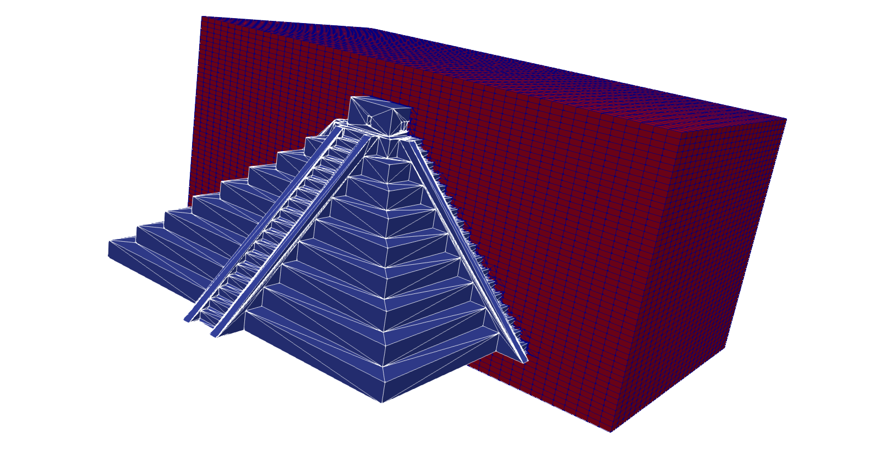

# STLCutters

STL to cell-wise triangulation to solve FE problems in [Gridap.jl](https://github.com/gridap/Gridap.jl) through [GridapEmbedded.jl](https://github.com/gridap/GridapEmbedded.jl)

[](https://authors.elsevier.com/c/1er0r508HsZ58)<!-- Restore on May 21th, 2022(https://doi.org/10.1016/j.jcp.2022.111162)-->
[](https://github.com/gridap/STLCutters.jl/actions?query=workflow%3ACI)
[](https://codecov.io/gh/gridap/STLCutters.jl)


## Installation

```julia
# Type ] to enter package mode
pkg> add STLCutters
```

## Examples

### Sub-triangulation examples

Use a test geometry, e.g., `47076.stl` (Chichen Itza)
```julia
julia> include("examples/SubTriangulation.jl")
julia> filename = "test/data/47076.stl"
julia> SubTriangulation.main(filename,n=50,output="example1")
```


Download a geometry directly from [Thingi10k](https://ten-thousand-models.appspot.com/), e.g, [37384](https://ten-thousand-models.appspot.com/detail.html?file_id=37384)
```julia
julia> include("examples/SubTriangulation.jl")
julia> filename = SubTriangulation.download(37384)
julia> SubTriangulation.main(filename,n=50,output="example2")
```


### Finite Elements examples

Solve a **Poisson** equation on a test geometry, e.g., `293137.stl` (Low-Poly Bunny)
 ```julia
julia> include("examples/Poisson.jl")
julia> filename = "test/data/293137.stl"
julia> Poisson.main(filename,n=20,output="example3")
```


Solve a **Linear Elasticity** problem on a test geometry, e.g., `550964.stl` (Eiffel Tower in a 5 degree slope)
 ```julia
julia> include("examples/LinearElasticity.jl")
julia> filename = "test/data/550964.stl"
julia> LinearElasticity.main(filename,n=50,force=(tand(5),0,-1),output="example4")
```


Solve an **Incompressible Flow** problem on a test geometry, e.g., `47076.stl` (Chichen Itza)
 ```julia
julia> # ENV["ENABLE_MKL"] = "" ## Uncomment if GridapPardiso.jl requirements are fulfilled
julia> include("examples/Stokes.jl")
julia> filename = "test/data/47076.stl"
julia> Stokes.main(filename,n=10,output="example5")
```


