<style>
section {
  padding-top: 10px;
}
</style>


<!-- _paginate: skip-->
<!-- _footer: "" -->
<!-- _backgroundColor:  #f2f4f4 -->


<div style="text-align:center;padding-top:70px">

# STLCutters.jl

Pere Antoni Martorell 

1 Aug 2024

</div>

<div style="position:absolute;top:150px;left:25px">
  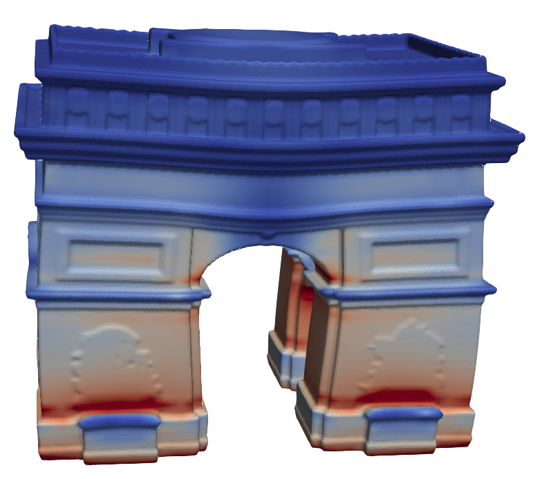
</div>

<div style="position:absolute;top:100px;right:25px">
  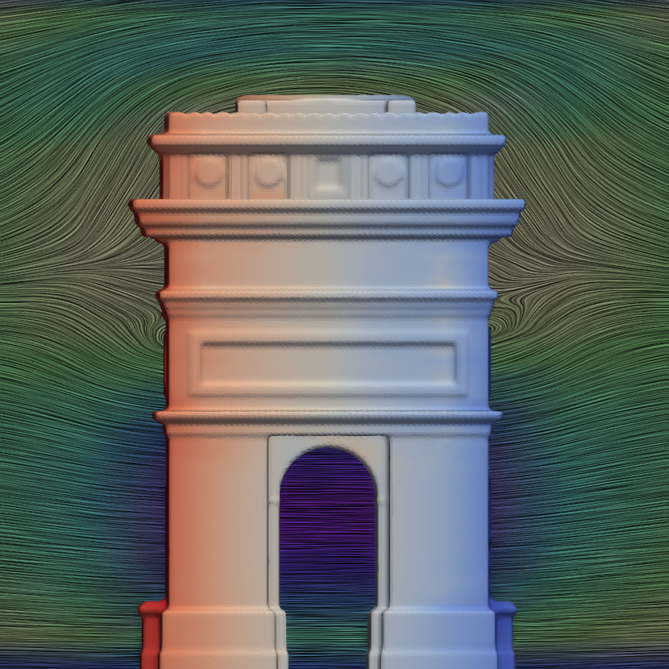
</div>

<div style="position:relative;bottom:-250px;width:1000px;left:70px;background-color:white">

<div class="image-row">


  

  

  

  


</div>
</div>


---
<!-- backgroundColor:  white -->
<!-- _backgroundColor:  white -->


# Outline

<div class="outline">

- Why STLCutters.jl
- What is STLCutters.jl
- How to use and contribute
- Future Work
- Hands-on & Questions

</div>

---


# Outline

<div class="outline">

- **Why STLCutters.jl**
- What is STLCutters.jl
- How to use and contribute
- Future Work
- Hands-on & Questions

</div>

---


# Unfitted Finite Elements

<div style="text-align:center">

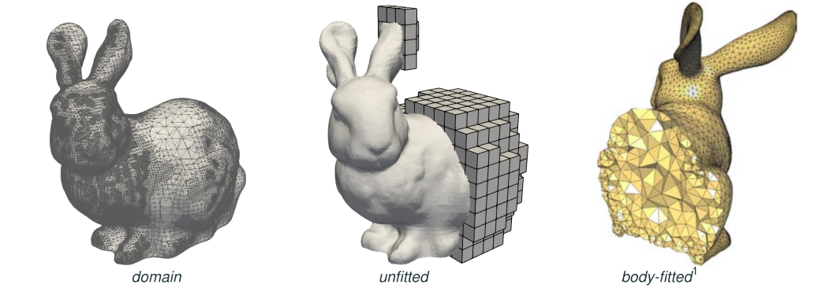

</div>


---

# Unfitted Geometries

<div style="text-align:center;vertical-align:center">

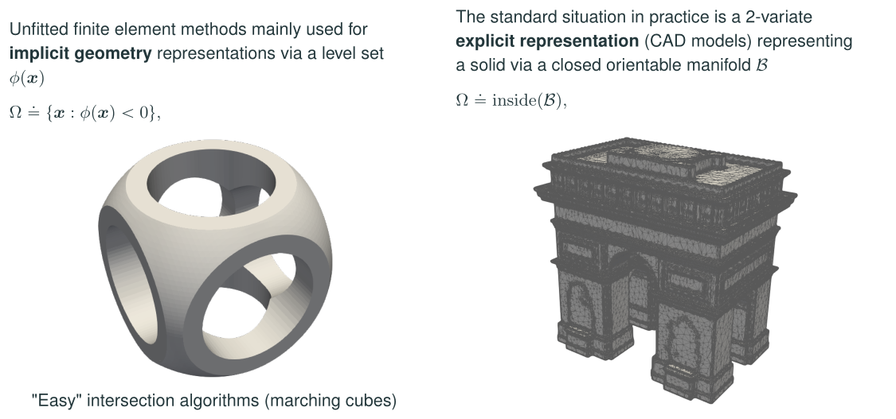

</div>


<div style="font-size:15px">

S. Badia, P. A. Martorell, F. Verdugo. _Geometrical discretisations for unfitted finite elements on explicit boundary representations._ J. Comput. Phys. 460 (2022): 111162.

</div>

---

# Long term goals 

<div style="border: 10px solid #b7950b;border-radius: 20px;
;padding-left:50px;padding-top:0px;padding-bottom:0px;font-size:25px;background-color:#fcf3cf">

**Fluid-structure interaction (FSI) on unfitted FEM**

- Discretizations for real STL and CAD geometries
- FSI solvers for unfitted FE
- Large-scale computations

</div>


My PhD Thesis:

<div class="columns" style="font-size:25px">
<div>

✅ Discretization on STL geometries
✅ High-order discretizations for CAD geometries (private repo)
✅ Space-time transient unfitted FE (private repo)
✅ Distributed memory parallelism

</div>
<div>

❌ Fluid-structure interaction (FSI) and multiphysics
❌ Adaptive mesh refinement (AMR)
❌ Large-scale computations

</div>
</div>

<!-- TODO: focus on FSI and large-scale -->

---
# Outline

<div class="outline">


- Why STLCutters.jl
- **What is STLCutters.jl**
- How to use and contribute
- Future Work
- Hands-on & Questions

</div>

---

# Gridap and Julia

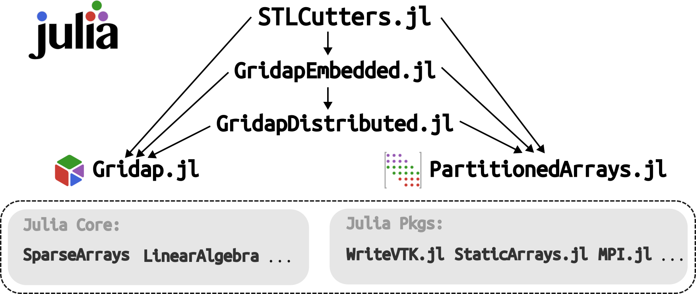

---
# Cell-wise intersection

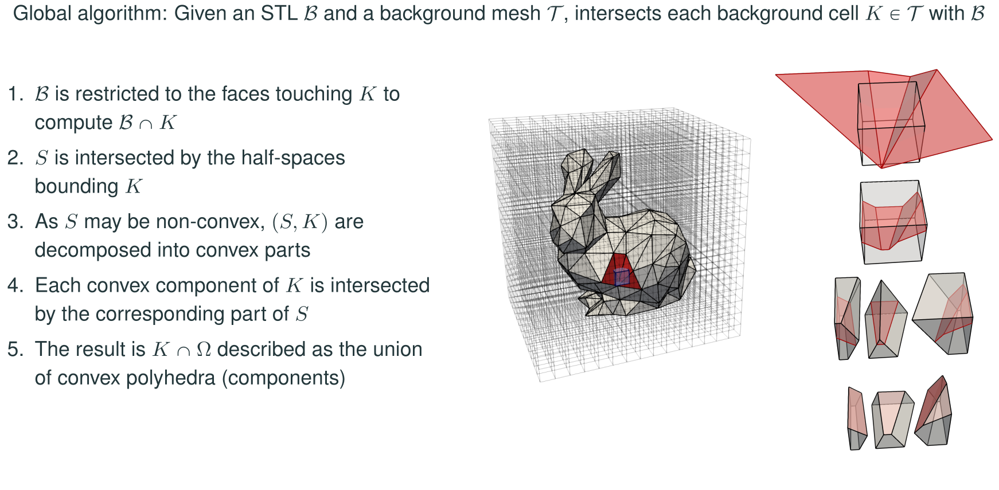

--- 

# Achievements: Robustness


<small>

$\epsilon _v = | V_\mathrm{in} + V_\mathrm{out} - V_\mathrm{box} | / V_\mathrm{box} < 10^{-10}$ for 100% of 4726 STLs in [Thingi10K](https://ten-thousand-models.appspot.com/results.html?q=is+solid%2C+is+manifold)

</small>


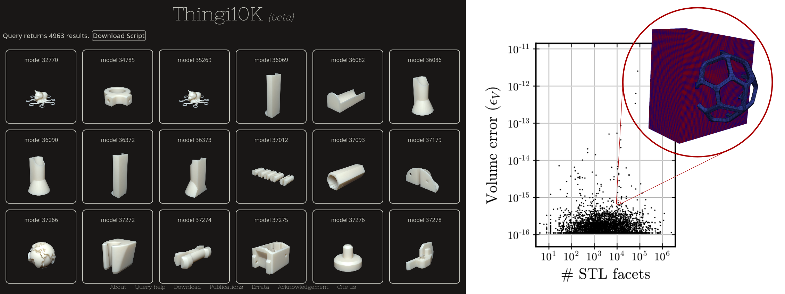


---

# Achievements: Robustness


<div style="text-align:center">

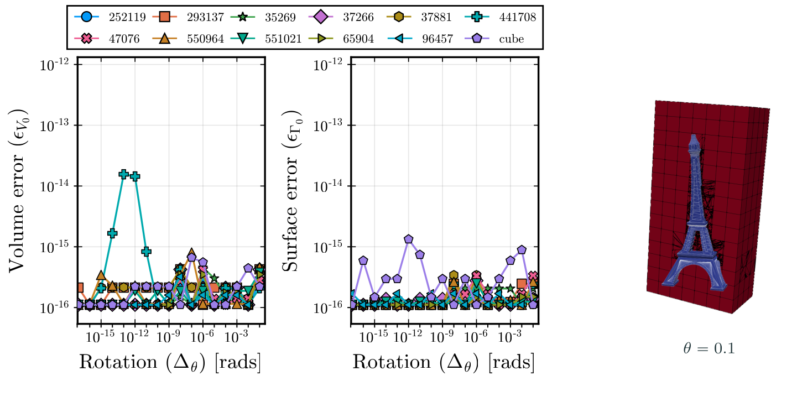

</div>

---

# Achievements: Parallel Scalability


<div style="text-align:center">

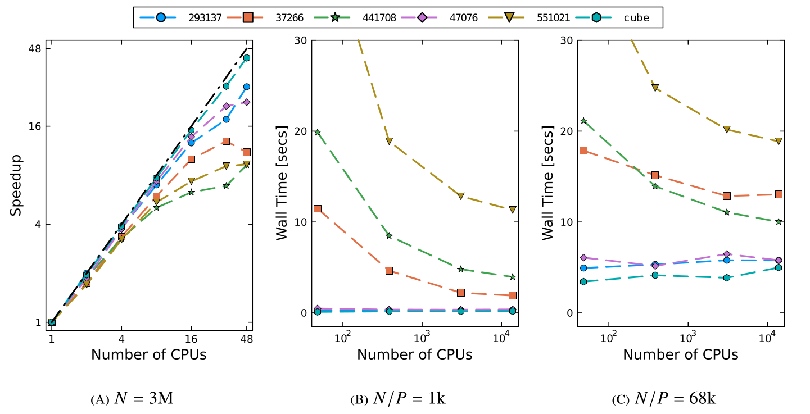

</div>

<div style="text-align:center; font-weight:bold ">
<small>
⚠️ Unpublished results!
</small>
</div>

---

# Outline

<div class="outline">

- Why STLCutters.jl
- What is STLCutters.jl
- **How to use and contribute**
- Future Work
- Hands-on & Questions

</div>

---

# Using STLCutters.jl

<div class="columns">
<div>

- Install

```julia
] add STLCutters                                     
```
- Or download
```bash
git clone https://github.com/gridap/STLCutters.jl.git
```

- Gridap & GridapEmbedded API

- GridapDistributed & GridapP4est compatibility

</div>
<div>

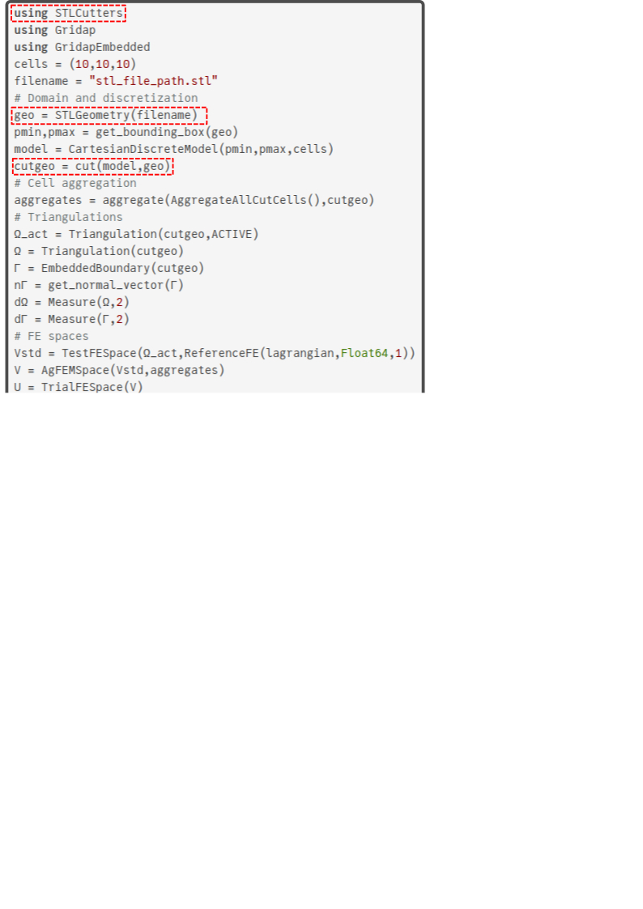

</div>
</div>


---

# Distributed usage


<div class="columns">
<div>

```bash
mpiexec -np 8 julia example.jl
```


</div>
<div>

```julia
] add GridapP4est
```

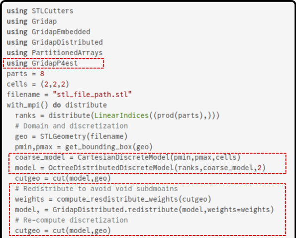


</div>
</div>

---

# Distributed usage


<div style="padding-top:70px">


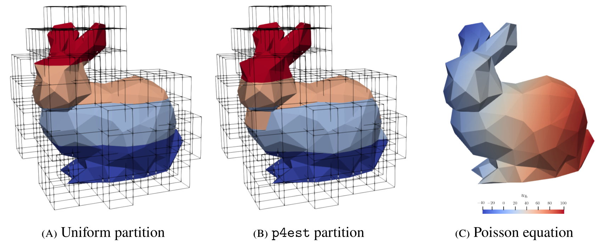

</div>

---

# Adaptive Mesh Refinement (AMR)


<div class="columns">
<div>

2:1 $k$-balanced in `p4est`

```julia
flags = adapt_cut_cells(parts,cutgeo)
model, = Gridap.Adaptivity.adapt(model,flags)
cutgeo = cut(model,geo)
```

</div>
<div>


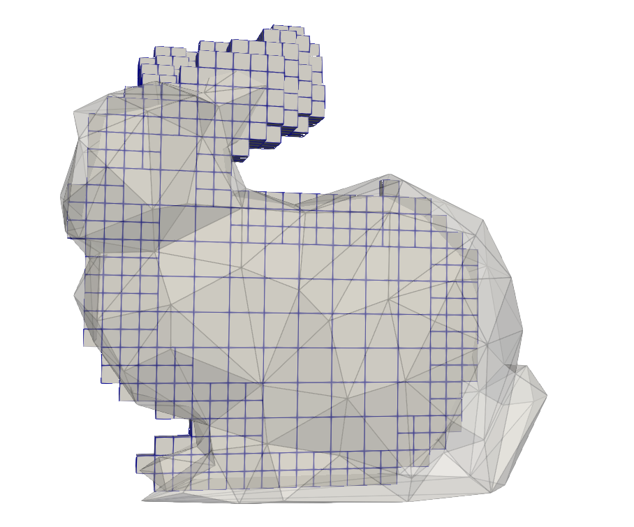

</div>
</div>

---
# Coding style

-  Gridap-like coding style

-  Semantic Versioning: Julia registry, registered dependencies

-  GitHub Utilities: Issues, PRs, CI

- Documentation: _docstrings_, documentation pages


---

# Code structure

<div style="vertical-align:center;padding-top:20px">

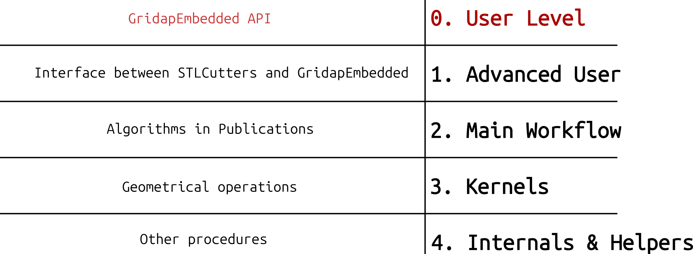

</div>

---

# Code structure

<div style="vertical-align:center;padding-top:20px">

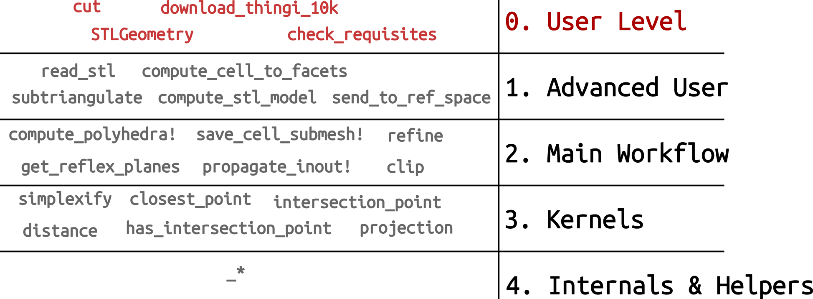

</div>

---

# Package files


**src/**: 5k code lines
├── **STLCutters.jl**: Main module with imports and exports
├── **SubTriangulations.jl**: Core of the package with main algorithms
├── **STLs.jl**: Load, clean and manage STL geometries
├── **Polyhedra.jl**: General polytope operations
├── **SimplexFaces.jl**: Geometrical operations on simplicies
├── **Embedded.jl**: Extending GridapEmbedded API
└── **Distributed.jl**: Extending distributed functions and algorithms


---

# Core procedures


<div class="columns">
<div>

```julia
function subtriangulate(stl,bgmodel)
c_to_f = compute_cell_to_facets(bgmodel,stl)
submesh = _empty_submesh()
for cell in findall(!isempty,c_to_f)
    Γ = stl[c_to_f[cell]]
    P = compute_polyhedra(cell,bgmodel,Γ)
    save_cell_submesh!(submesh,cell,P...)
end
propagate_inout!(submesh)
delete_small_cells(submesh)
grids = compute_grids(submesh)
labels = SubtriangulationLabels(submesh)
return grids,labels
end
```

</div>
<div>

```julia
function compute_polyhedra(cell,bgmodel,Γ)
K = Polyhedron(bgmodel,cell)
Γk = clip(Γ,planes(K))  
Kin,Kout = refine(K,planes(Γk),reflex_planes(Γk))
return Kin,Kout,Γk
end
```     
```julia
function save_cell_submesh!(submesh,cell,Kin,Kout,Γk)
_submesh,_face_submesh = submesh
append!(_submesh,cell,simplexify(Kin),simplexify(Kout))
append!(_face_submesh,cell,simplexify(Γk))
end
```
</div>
</div>

ℹ️ Some functions have been simplified for demonstration purposes


---

# Outline

<div class="outline">

- Why STLCutters.jl
- What is STLCutters.jl
- How to use and contribute
- **Future Work**
- Hands-on & Questions

</div>

---

# Future Work

- Extract mesh of general polytopes [STLCutters.jl#37](https://github.com/gridap/STLCutters.jl/issues/37)
- Reduce memory allocations [STLCutters.jl#38](https://github.com/gridap/STLCutters.jl/issues/38)
- Deal with disconnected subdomains [STLCutters.jl](https://github.com/gridap/STLCutters.jl)
- Distribute space-time methods [STLCutters.jl](https://github.com/gridap/STLCutters.jl)
- AMR with unfitted AgFEM [GridapEmbedded.jl](https://github.com/gridap/GridapEmbedded.jl)
- Fix moment fitting in parallel [GridapEmbedded.jl#94](https://github.com/gridap/GridapEmbedded.jl/issues/94)
- Solve void subdomains [GridapDistributed.jl](https://github.com/gridap/GridapDistributed.jl)

- Test distributed solvers on unfitted FSI

---

# Acknowledgments

-  Special acknowledgments:
    - Supervisors: Santiago Badia & Francesc Verdugo
    - Contributors: STLCutters & Gridap ecosystem
    - Users
    - You

 - Thanks for giving a star on GitHub

 

---

# Hands-on & Questions


- Visit the GitHub page: https://github.com/gridap/STLCutters.jl

- Check the documentation: https://gridap.github.io/STLCutters.jl

- Locally navigate the repository & run examples:
```bash
git clone https://github.com/gridap/STLCutters.jl.git
code STLCutters.jl
```
```julia
julia> include("examples/LinearElasticity.jl")
julia> filename = "test/data/550964.stl"
julia> LinearElasticity.main(filename,n=50,force=(tand(5),0,-1),output="example4")
```
